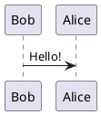

# Writerside PlantUML Reference

在下列情況讀這份參考：

- 想在 Writerside topic 裡畫 UML、JSON、Gantt chart、mind map 等圖
- 想使用 ` ```plantuml ` 或 `<code-block lang="plantuml">`
- 想從 `.puml` 檔引用圖表，而不是把圖表內容直接寫進 topic
- 想排查 Graphviz、CDATA、`<` / `>` 跳脫、variables 在 PlantUML 裡的行為

這份筆記依據 JetBrains 官方文件整理：

- `PlantUML diagrams`
- `Code`

## 先判斷該不該用 PlantUML

- 要表達 UML 類型圖、關係圖、use case、JSON/YAML 結構、Gantt 或 mind map 時，PlantUML 很適合。
- 如果只是一般流程圖或簡單分支，Mermaid 往往更輕量。
- 如果要展示真實 UI 畫面，還是圖片比較直接。

這個 repo 的預設判斷：

- 講軟體結構、角色關係、資料結構或規劃時程時，可考慮 PlantUML。
- 如果只是單純流程走向，先想想 Mermaid 會不會更簡潔。

## 基本寫法

- 最直接的方式是使用 language 為 `plantuml` 的 code block。
- Markdown 和 XML 都可以。

Markdown 範例：

````markdown

````

XML 範例：

```xml
<code-block lang="plantuml">
@startuml
Bob->Alice : Hello!
@enduml
</code-block>
```

## 常見適用類型

官方頁面示範了這些類型：

- class diagram
- use case diagram
- JSON data
- Gantt chart
- mind map

延伸到這個 repo，常見可考慮的情境是：

- class diagram：類別或模組關係
- use case diagram：角色與功能關係
- JSON / YAML：資料結構概覽
- Gantt：簡單時程規劃
- mind map：主題整理或知識樹

## 從檔案引用 PlantUML

- 如果 PlantUML 程式碼已經放在獨立檔案，可以用 `src` 引用。
- 這和其他 `code-block src="..."` 的概念一樣。

範例：

```xml
<code-block lang="PlantUML" src="graph.puml"/>
```

Markdown 也可以：

````markdown
```PlantUML
```
{ src="graph.puml" }
````

- 也可以用相對路徑，例如 `../codeSnippets/graph.puml`。
- 單篇、單次使用時，通常直接內嵌內容就夠了。
- 要跨篇共用或圖表很長時，再抽成 `.puml` 檔。

## Graphviz 疑難排解

官方特別提醒，有些 PlantUML 圖會依賴 Graphviz / DOT 來計算節點位置。

如果輸出結果出現這類訊息：

```text
Dot Executable: /opt/local/bin/dot
Dot executable does not exist
Cannot find Graphviz
```

代表建置 topic 的那台機器沒有安裝 Graphviz。

實務判斷：

- 先確認不是 PlantUML 語法錯誤。
- 如果錯誤明確提到 `dot` 或 `Cannot find Graphviz`，就往 Graphviz 缺失處理。
- 需要在建置環境安裝 Graphviz，而不是只在本機編輯器裡修 Markdown。

## XML / semantic code block 的 `<` `>` 問題

- 在 XML topics，或在 Markdown topic 中使用 semantic `code-block` 時，如果 PlantUML 內容含有 `<`、`>`，很容易被當成真正標記解析。
- 官方建議兩種處理方式：
  - 用 `CDATA`
  - 或把它們跳脫成 `&lt;`、`&gt;`

原始容易出錯的例子：

```xml
<code-block lang="plantuml">
@startuml
User << Human >>
@enduml
</code-block>
```

較穩定的寫法：

```xml
<code-block lang="plantuml"><![CDATA[
@startuml
User << Human >>
@enduml
]]></code-block>
```

或：

```xml
<code-block lang="plantuml">
@startuml
User &lt;&lt; Human &gt;&gt;
@enduml
</code-block>
```

- 如果你是在 Writerside 編輯器裡操作，官方也提到可用 `Alt+Enter` 的 `Wrap inner elements with CDATA`。

## Variables 與 `ignore-vars`

- Writerside 在 PlantUML 中，預設會忽略 variables，照字面渲染。
- 也就是說，像 `%v1%` 這類內容預設不會自動展開。
- 如果你真的想讓 PlantUML 使用專案裡定義的變數，要明確設 `ignore-vars="false"`。

範例：

```xml
<var name="v1" value="1.0"/>
<var name="v2" value="2.0"/>
<code-block lang="plantuml" ignore-vars="false"><![CDATA[
@startuml
[Component] --> "Interface %v1%"
[Component] --> "Interface %v2%"
@enduml
]]></code-block>
```

判斷準則：

- 大多數 PlantUML 圖先維持預設行為就好。
- 只有在圖裡真的要顯示專案版本、產品名稱等共享值時，再開 `ignore-vars="false"`。

## 和其他機制的分工

- PlantUML vs Mermaid
  - UML / JSON / Gantt / mind map：PlantUML
  - 輕量流程圖、狀態流、Git flow：Mermaid
- PlantUML vs 一般 code block
  - 要渲染圖：PlantUML
  - 要讓讀者複製程式碼：一般 code block
- PlantUML vs 圖片
  - 需要可版本化、文字可維護的圖：PlantUML
  - 需要真實畫面或複雜視覺設計：圖片

## 寫作建議

- 圖表前先說明它要解釋什麼，不要直接丟一大段 `@startuml`。
- 如果圖表語法變很長，優先抽成 `.puml` 檔，不要把 topic 變得難讀。
- 在 XML / semantic code block 裡，只要出現 `<<...>>`、泛型或其他尖括號，本能先想到 `CDATA`。
- 遇到建置失敗時，先分辨是 Graphviz 缺失、XML 解析問題，還是 PlantUML 本身語法錯。

## 在這個 repo 的採用建議

- 目前 repo 內還沒有既定的 PlantUML topic 範例。
- 這代表可以導入，但最好維持保守：先用簡單的 fenced PlantUML block 驗證能正常輸出。
- 若要在同一篇文章混用 Writerside XML 與 PlantUML，優先採用 `CDATA`，避免因 `<`、`>` 解析踩雷。
- 如果需求只是簡單流程圖，優先考慮 repo 已經在使用的 Mermaid；如果需求明顯偏 UML 或資料結構，再切 PlantUML。
