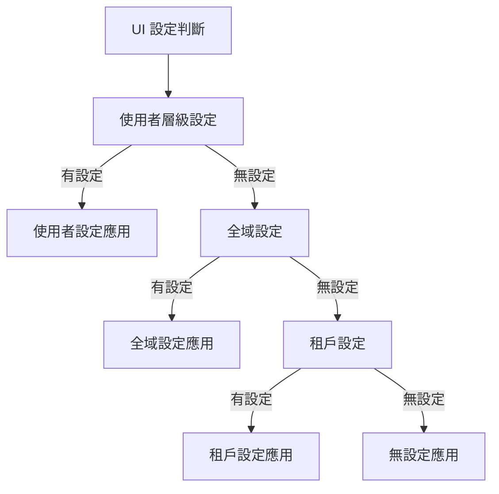

# SettingUi
用於管理 ABP 設定的模組

## 結論
想透過 UI 更改全域設定時，須於設定時加上`.WithProviders(GlobalSettingValueProvider.ProviderName)`，否則預設為租戶。

### 範例

```C#
context.Add(
    new SettingDefinition(
            "Connection.Ip", // Setting name
            "127.0.0.1", // Default value
            L("DisplayName:Connection.Ip"), // Display name
            L("Description:Connection.Ip") // Description
        )
        .WithProperty(SettingUiConst.Group1, "Server")
        .WithProperty(SettingUiConst.Group2, "Connection")
        .WithProviders(GlobalSettingValueProvider.ProviderName)
);
```

## 說明
UI 設定時的判斷順序為：使用者層級設定 -> 全域設定 -> 租戶設定



### 參照
[SettingUiAppService.cs#L180-L183](https://github.com/EasyAbp/Abp.SettingUi/blob/42a639bc918184bad67194a27565012d97db8a3c/src/EasyAbp.Abp.SettingUi.Application/SettingUiAppService.cs#L180-L183)
```C#
protected virtual Task SetSettingAsync(SettingDefinition setting, [CanBeNull] string value)
{
    if (setting.Providers.Any(p => p == UserSettingValueProvider.ProviderName))
    {
        return _settingManager.SetForCurrentUserAsync(setting.Name, value);
    }

    if (setting.Providers.Any(p => p == GlobalSettingValueProvider.ProviderName))
    {
        return _settingManager.SetGlobalAsync(setting.Name, value);
    }

    return ShouldManageAsGlobal(setting)
        ? _settingManager.SetGlobalAsync(setting.Name, value)
        : _settingManager.SetForCurrentTenantAsync(setting.Name, value);
}
```

## REF
[Abp.SettingUi](https://easyabp.io/modules/Abp.SettingUi/)