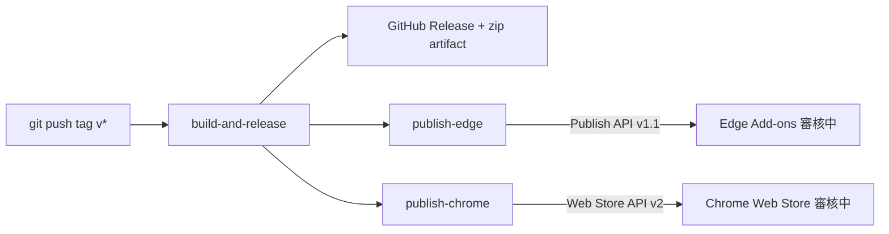

# 用 GitHub Actions 自動發布 Chrome 與 Edge 擴充套件到商店

<web-summary>瀏覽器擴充套件打 tag 後由 GitHub Actions 打包 zip、建 GitHub Release，並用 Edge Add-ons Publish API v1.1 與 Chrome Web Store API v2 自動上傳送審；本文整理憑證申請、workflow 寫法與常見坑。</web-summary>

只要 `git tag vX.Y.Z && git push origin vX.Y.Z`，一條 workflow 就能完成：打包 zip、建立 GitHub Release，再把同一個 zip 分別上傳到 Microsoft Edge Add-ons 與 Chrome Web Store 並送審。兩個商店都有官方 REST API，不需要第三方 action，純 `curl` 加 `jq` 就能接；沒設定 secrets 時讓對應的 job 自動略過，這樣沒申請憑證前發版流程也不會壞。

<tldr>
    <p>Edge 用 Publish API v1.1，憑證是 Partner Center 產生的 Client ID 加 API key，沒有 OAuth。</p>
    <p>Chrome 用 Web Store API v2（2025 年 10 月起），憑證是 Google Cloud OAuth 用戶端加 refresh token；同意畫面停在「測試中」會讓 token 7 天過期。</p>
    <p>兩邊的 API 都只能「更新既有產品的套件並送審」，首次上架、商店描述與截圖仍要在後台手動處理。</p>
</tldr>

> 本文中的 Product ID、Extension ID、Publisher ID 與 secrets 都已改成占位符，請換成自己後台的值。

## 整體流程



- `build-and-release`：依 tag 覆寫 `manifest.json` 版號、打包 zip、建 GitHub Release，並用 `actions/upload-artifact` 把 zip 留給後面的 job。
- `publish-edge`、`publish-chrome`：`needs: build-and-release`，各自檢查 secrets，有才跑。
- 版號單一來源是 `manifest.json`；tag 的數字必須跟它一致，否則商店會拒收重複或倒退的版本。

## 前置條件

- 擴充套件已經在兩個商店手動上架過一次。API 只能更新既有產品，沒有「建立新產品」的端點。
- Repo 有可用的 release workflow，能產出 zip。zip 內只放 `manifest.json`、腳本、樣式與 icons，不要把 README 或測試檔一起包進去。
- 本機有 `gh` CLI，設定 secrets 與查 workflow 結果都靠它。

## Edge Add-ons：Publish API v1.1

### 申請憑證

1. 登入 [Partner Center](https://partner.microsoft.com/dashboard/microsoftedge/publishapi)，左側 Microsoft Edge 底下選 **Publish API**。
2. 按「開啟 API」，再按「建立 API 認證」，會得到 **Client ID** 與一組 **API key**。API key 有到期日，到期要重新產生並更新 secret。
3. **Product ID** 在「擴充功能概觀 → 延伸身分識別」，也是後台網址中 `microsoftedge/` 與 `/packages` 之間的 GUID。它不是機密，可以直接寫在 workflow。
4. 在自己的終端機設定 secrets，貼上時不會回顯：

```bash
gh secret set EDGE_CLIENT_ID
gh secret set EDGE_API_KEY
```

<note>
    <p>舊的 v1 流程（client secret 換 access token）已於 2024 年底停止支援；網路上很多文章仍在講 v1，照抄會拿到 401。</p>
</note>

### API 呼叫順序

| 步驟 | 方法與路徑 | 回應 |
|------|-----------|------|
| 上傳 zip | `POST /v1/products/{productId}/submissions/draft/package` | `202`，`Location` 標頭尾段是 operationId |
| 等驗證 | `GET …/draft/package/operations/{operationId}` | `status` 為 `InProgress` / `Succeeded` / `Failed` |
| 送審 | `POST /v1/products/{productId}/submissions`，body `{"notes": "審核備註"}` | `202` + operationId |
| 等送審 | `GET …/submissions/operations/{operationId}` | `Succeeded` 代表已進入人工審核 |

每個請求都帶兩個標頭：`Authorization: ApiKey <api-key>` 與 `X-ClientID: <client-id>`。上傳時再加 `Content-Type: application/zip`。

### Workflow job

```yaml
  publish-edge:
    needs: build-and-release
    runs-on: ubuntu-latest
    env:
      EDGE_PRODUCT_ID: <edge-product-id>
      EDGE_CLIENT_ID: ${{ secrets.EDGE_CLIENT_ID }}
      EDGE_API_KEY: ${{ secrets.EDGE_API_KEY }}
      EDGE_API: https://api.addons.microsoftedge.microsoft.com
      VERSION: ${{ needs.build-and-release.outputs.version }}
    steps:
      - name: Check credentials
        id: creds
        run: |
          if [ -z "$EDGE_CLIENT_ID" ] || [ -z "$EDGE_API_KEY" ]; then
            echo "enabled=false" >> $GITHUB_OUTPUT
          else
            echo "enabled=true" >> $GITHUB_OUTPUT
          fi

      - uses: actions/download-artifact@v4
        if: steps.creds.outputs.enabled == 'true'
        with:
          name: extension-package

      - name: Upload package
        if: steps.creds.outputs.enabled == 'true'
        id: upload
        run: |
          HEADERS=$(mktemp)
          CODE=$(curl -sS -o /dev/null -D "$HEADERS" -w '%{http_code}' \
            -H "Authorization: ApiKey $EDGE_API_KEY" \
            -H "X-ClientID: $EDGE_CLIENT_ID" \
            -H "Content-Type: application/zip" \
            -X POST --data-binary "@my-extension-${VERSION}.zip" \
            "$EDGE_API/v1/products/$EDGE_PRODUCT_ID/submissions/draft/package")
          [ "$CODE" = "202" ] || { echo "::error::upload failed HTTP $CODE"; exit 1; }
          OP=$(grep -i '^Location:' "$HEADERS" | tr -d '\r' | awk '{print $2}' | sed 's#.*/##')
          echo "operation_id=$OP" >> $GITHUB_OUTPUT

      - name: Wait for package validation
        if: steps.creds.outputs.enabled == 'true'
        run: |
          for i in $(seq 1 30); do
            STATUS=$(curl -sS -H "Authorization: ApiKey $EDGE_API_KEY" -H "X-ClientID: $EDGE_CLIENT_ID" \
              "$EDGE_API/v1/products/$EDGE_PRODUCT_ID/submissions/draft/package/operations/${{ steps.upload.outputs.operation_id }}" \
              | jq -r '.status // empty')
            case "$STATUS" in
              Succeeded) exit 0 ;;
              Failed) echo "::error::package validation failed"; exit 1 ;;
            esac
            sleep 10
          done
          exit 1

      - name: Publish submission
        if: steps.creds.outputs.enabled == 'true'
        run: |
          curl -sS -o /dev/null -w '%{http_code}\n' \
            -H "Authorization: ApiKey $EDGE_API_KEY" \
            -H "X-ClientID: $EDGE_CLIENT_ID" \
            -H "Content-Type: application/json" \
            -X POST -d '{"notes":"Automated submission via GitHub Actions"}' \
            "$EDGE_API/v1/products/$EDGE_PRODUCT_ID/submissions"
```

送審後同樣要輪詢 `…/submissions/operations/{operationId}`，寫法與等驗證那一步相同，這裡省略。實測從上傳到 `Succeeded` 約 15 秒，之後 Microsoft 人工審核約 7 個工作天。

## Chrome Web Store：Web Store API v2

### 申請憑證

Google 的憑證不在 Chrome Web Store 開發人員資訊主頁，要去 Google Cloud Console 建 OAuth 用戶端，流程比 Edge 長很多。

1. **Publisher ID**：開發人員資訊主頁左側「發布者 → 設定」。**Extension ID** 就是商店網址最後那段 32 個小寫字母。
2. **啟用 API**：Google Cloud Console 建立或選一個專案，「API 和服務 → 程式庫」搜尋 **Chrome Web Store API** 並啟用。
3. **OAuth 同意畫面**：使用者類型選「外部」，範圍留空，「測試使用者」加入自己的 Google 帳號（必須是擴充套件的開發者帳號）。
4. **OAuth 用戶端**：「憑證 → 建立憑證 → OAuth 用戶端 ID」，類型選「網頁應用程式」，已授權的重新導向 URI 填 `https://developers.google.com/oauthplayground`，記下 **Client ID** 與 **Client Secret**。
5. **換 refresh token**：開 [OAuth 2.0 Playground](https://developers.google.com/oauthplayground)，右上齒輪勾 **Use your own OAuth credentials** 填入 Client ID / Secret，左側 Step 1 手動輸入範圍 `https://www.googleapis.com/auth/chromewebstore`，Authorize APIs 後在 Step 2 按 **Exchange authorization code for tokens**，複製 **Refresh token**。
6. 設定 secrets：

```bash
gh secret set CHROME_PUBLISHER_ID
gh secret set CHROME_CLIENT_ID
gh secret set CHROME_CLIENT_SECRET
gh secret set CHROME_REFRESH_TOKEN
```

<warning>
    <p>同意畫面停在「測試中」狀態時，Google 會讓 refresh token 在 7 天後失效。設定完成後回到「OAuth 同意畫面」按「發布應用程式」改成正式版；<code>chromewebstore</code> 不是敏感範圍，不需要送 Google 驗證，只會在自己授權時看到「未驗證的應用程式」警告。</p>
</warning>

轉正式版時要填應用程式首頁、隱私權政策、服務條款連結與已授權網域。已授權網域填根網域（例如 `example.com`），首頁與政策頁必須落在這個網域下，所以要先有一個自己的網站，GitHub 網址不能充數。

### API 呼叫順序

| 步驟 | 方法與路徑 | 回應 |
|------|-----------|------|
| 換 token | `POST https://oauth2.googleapis.com/token`，`grant_type=refresh_token` | `access_token`，約 1 小時有效 |
| 上傳 zip | `POST https://chromewebstore.googleapis.com/upload/v2/publishers/{publisherId}/items/{itemId}:upload` | `uploadState`：`SUCCEEDED` / `IN_PROGRESS` / `FAILED` |
| 查處理狀態 | `GET https://chromewebstore.googleapis.com/v2/publishers/{publisherId}/items/{itemId}:fetchStatus` | `lastAsyncUploadState` |
| 送審 | `POST …/items/{itemId}:publish`，body `{"publishType":"DEFAULT_PUBLISH"}` | `state` 與 `warningInfo.warnings[]` |

<note>
    <p>v2 是 2025 年 10 月起的新版；舊的 v1.1 端點（<code>www.googleapis.com/chromewebstore/v1.1/items/{id}</code>，帶 <code>x-goog-api-version: 2</code> 標頭）已封存。網路上的 action 與範例多數仍是 v1.1，照抄前先確認。</p>
</note>

### Workflow job

```yaml
  publish-chrome:
    needs: build-and-release
    runs-on: ubuntu-latest
    env:
      CHROME_EXTENSION_ID: <chrome-extension-id>
      CHROME_PUBLISHER_ID: ${{ secrets.CHROME_PUBLISHER_ID }}
      CHROME_CLIENT_ID: ${{ secrets.CHROME_CLIENT_ID }}
      CHROME_CLIENT_SECRET: ${{ secrets.CHROME_CLIENT_SECRET }}
      CHROME_REFRESH_TOKEN: ${{ secrets.CHROME_REFRESH_TOKEN }}
      CWS_API: https://chromewebstore.googleapis.com
      VERSION: ${{ needs.build-and-release.outputs.version }}
    steps:
      - name: Check credentials
        id: creds
        run: |
          if [ -z "$CHROME_CLIENT_ID" ] || [ -z "$CHROME_REFRESH_TOKEN" ] || [ -z "$CHROME_PUBLISHER_ID" ]; then
            echo "enabled=false" >> $GITHUB_OUTPUT
          else
            echo "enabled=true" >> $GITHUB_OUTPUT
          fi

      - uses: actions/download-artifact@v4
        if: steps.creds.outputs.enabled == 'true'
        with:
          name: extension-package

      - name: Get access token
        if: steps.creds.outputs.enabled == 'true'
        id: token
        run: |
          TOKEN=$(curl -sS -X POST https://oauth2.googleapis.com/token \
            -d client_id="$CHROME_CLIENT_ID" \
            -d client_secret="$CHROME_CLIENT_SECRET" \
            -d refresh_token="$CHROME_REFRESH_TOKEN" \
            -d grant_type=refresh_token | jq -r '.access_token // empty')
          [ -n "$TOKEN" ] || { echo "::error::refresh token invalid or expired"; exit 1; }
          echo "::add-mask::$TOKEN"
          echo "token=$TOKEN" >> $GITHUB_OUTPUT

      - name: Upload package
        if: steps.creds.outputs.enabled == 'true'
        env:
          TOKEN: ${{ steps.token.outputs.token }}
        run: |
          ITEM="publishers/$CHROME_PUBLISHER_ID/items/$CHROME_EXTENSION_ID"
          STATE=$(curl -sS -X POST -H "Authorization: Bearer $TOKEN" -H "Content-Type: application/zip" \
            -T "my-extension-${VERSION}.zip" "$CWS_API/upload/v2/$ITEM:upload" | jq -r '.uploadState // empty')
          for i in $(seq 1 30); do
            case "$STATE" in
              SUCCEEDED) exit 0 ;;
              FAILED|"") echo "::error::upload failed"; exit 1 ;;
            esac
            sleep 10
            STATE=$(curl -sS -H "Authorization: Bearer $TOKEN" "$CWS_API/v2/$ITEM:fetchStatus" \
              | jq -r '.lastAsyncUploadState // empty')
          done
          exit 1

      - name: Publish item
        if: steps.creds.outputs.enabled == 'true'
        env:
          TOKEN: ${{ steps.token.outputs.token }}
        run: |
          ITEM="publishers/$CHROME_PUBLISHER_ID/items/$CHROME_EXTENSION_ID"
          curl -sS -X POST -H "Authorization: Bearer $TOKEN" -H "Content-Type: application/json" \
            -d '{"publishType":"DEFAULT_PUBLISH"}' "$CWS_API/v2/$ITEM:publish" | jq .
```

`::add-mask::` 那行很重要，否則 access token 會以明文出現在後續步驟的 log。

## 發版順序

1. 更新 `CHANGELOG.md` 與 `manifest.json` 版號，commit 並 push 到 main。
2. 確認 main 的 CI 綠燈。
3. 打 tag 並推上去，release workflow 只由 tag 觸發；只 push commit 不會產生 Release，也不會送審。

```bash
git tag v1.2.3
git push origin v1.2.3
gh run list --workflow=release.yml --limit 1
gh release view v1.2.3 --json name,url,assets
```

## 常見坑

- **版號用 jq 寫回會重排 manifest**：`jq '.version = $v'` 會展開陣列、刪空行，diff 多出十幾行雜訊。改用 `sed` 只動 `"version"` 那一行。
- **同版本已在後台手動送審中**：API 上傳會跟那份草稿衝突，Edge 會回錯誤、Chrome 會回 `ITEM_IN_REVIEW`。等審核結束或先在後台取消送審。
- **API 改不了商店資料**：描述、截圖、隱私揭露、分類仍要在 Partner Center 與開發人員資訊主頁手動維護，API 只管套件與送審。
- **憑證會過期**：Edge API key 有到期日；Chrome refresh token 在同意畫面未轉正式版時 7 天失效。把到期日記在文件裡，job 失敗時先查憑證再查程式。
- **Secrets 不要經手明文**：用 `gh secret set` 互動輸入，不要把值貼進 commit、issue 或 AI 對話。
- **`secrets` 不能用在 job 層級的 `if`**：所以先把 secrets 映射到 `env`，再在第一個 step 判斷並輸出 `enabled`，後面每個 step 都用 `if: steps.creds.outputs.enabled == 'true'`。

## 參考資料

- [Use the REST API to update an extension（Microsoft Edge）](https://learn.microsoft.com/microsoft-edge/extensions-chromium/publish/api/using-addons-api)
- [Using the Chrome Web Store Publish API](https://developer.chrome.com/docs/webstore/using-api)
- [Chrome Web Store API reference（v2）](https://developer.chrome.com/docs/webstore/api)
- [Google OAuth 2.0 refresh token 到期規則](https://developers.google.com/identity/protocols/oauth2#expiration)
- 完整 workflow 範例：[jakeuj/ChromeExtensionPobZh](https://github.com/jakeuj/ChromeExtensionPobZh/blob/main/.github/workflows/release.yml)
