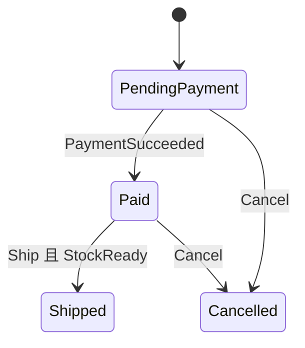

# C# 狀態機、狀態模式與策略模式：差異與選擇

<web-summary>以同一套 C# 訂單規則比較 switch、轉移表與 State Pattern，說明狀態機和策略模式的差異，並依行為複雜度、轉移規則及共存效果選擇設計。</web-summary>

先用狀態機釐清流程，再依行為複雜度選擇程式組織方式。狀態少、規則集中時，enum 加 switch 就夠；需要集中檢視轉移時用轉移表；各狀態有大量不同的行為時，再評估 State Pattern。**狀態數量不是選 State Pattern 的主要依據。**

[Unity 回合制戰鬥核心設計](unity-turn-based-battle-core.md) 是實際案例：戰鬥階段用狀態機、技能公式採策略式設計，Buff 則保存可共存的效果。這篇使用獨立的訂單範例說明概念，不要求戰鬥核心跟著重構。

## 狀態機與設計模式的層次不同 {#state-concept-levels}

狀態機（State Machine）是一種流程模型，描述目前狀態、觸發事件與允許的轉移。狀態模式（State Pattern）則是一種物件設計方式，把隨狀態改變的行為交給狀態物件處理。

| 概念 | 主要回答的問題 | 常見組織方式 |
| ------ | ------ | ------ |
| 狀態機 | 現在在哪個階段？哪些事件能移到哪裡？ | enum、switch、轉移表或狀態機工具 |
| State Pattern | 同一個操作在不同狀態下如何執行？ | Context 委派給目前的 State 物件 |
| Strategy Pattern | 這次要使用哪一套演算法？ | 使用者或調度器選擇策略實作 |
| Template Method | 共用流程有哪些固定步驟與可變步驟？ | 基底類別保存骨架，子類別實作部分步驟 |

GoF 的設計模式分為建立型、結構型與行為型；State、Strategy 與 Template Method 都屬於行為型。有限狀態機本身不是 GoF 的其中一個模式，也不需要先建立狀態類別才能成立。分類可核對 [Design Patterns 原書目錄](https://www.informit.com/store/design-patterns-elements-of-reusable-object-oriented-9780201633610)。

同一個流程可以用 switch、轉移表或 State Pattern 實作。因此「使用狀態機」與「使用 State Pattern」可以同時成立。

## 先定義狀態、事件、條件與動作 {#state-order-rules}

以下範例使用單一互斥狀態的有限狀態機。更進階的 statechart 可以有階層或平行狀態；可參考 [W3C SCXML 的基本狀態機、複合狀態與平行狀態說明](https://www.w3.org/TR/scxml/#BasicStateMachineNotation)。

| 元素 | 意義 | 本例 |
| ------ | ------ | ------ |
| State | 目前階段 | 待付款、已付款、已出貨、已取消 |
| Event | 觸發轉移的輸入 | 付款成功、出貨、取消 |
| Transition | 允許的起點與終點 | 已付款收到出貨事件後變成已出貨 |
| Guard | 允許轉移的條件 | 出貨前庫存已備妥 |
| Action | 轉移執行的動作 | 成功出貨時增加一次出貨紀錄 |

三份實作都使用下面這套規則；未列出的組合一律拒絕：

| 目前狀態 | 事件 | 條件 | 下一個狀態 |
| ------ | ------ | ------ | ------ |
| 待付款 | 付款成功 | 無 | 已付款 |
| 待付款 | 取消 | 無 | 已取消 |
| 已付款 | 出貨 | 庫存已備妥 | 已出貨 |
| 已付款 | 取消 | 無 | 已取消 |

流程如下：



`PaymentSucceeded` 表示付款結果已確認，不是請求扣款。取消已付款訂單的退款流程、物流 API、持久化與併發控制均省略；這是流程比較範例。`ShipmentCount` 只代表本機動作執行次數。

以下共用定義與三個類別可以放在同一個 Console 專案中。範例使用 C# 9 以上語法，屬於獨立教學程式，不代表所有 Unity 專案都支援同一版本。

```C#
public enum OrderStatus
{
    PendingPayment,
    Paid,
    Shipped,
    Cancelled
}

public enum OrderEvent
{
    PaymentSucceeded,
    Ship,
    Cancel
}
```

## 用 switch 保存集中且簡單的規則 {#state-switch-example}

狀態與事件一起決定轉移；合法轉移、Guard 與 Action 都集中在 `Fire()`。

```C#
public sealed class SwitchOrder
{
    public OrderStatus Status { get; private set; }
        = OrderStatus.PendingPayment;
    public bool StockReady { get; set; }
    public int ShipmentCount { get; private set; }

    public void Fire(OrderEvent trigger)
    {
        switch ((Status, trigger))
        {
            case (OrderStatus.PendingPayment,
                  OrderEvent.PaymentSucceeded):
                Status = OrderStatus.Paid;
                return;

            case (OrderStatus.PendingPayment, OrderEvent.Cancel):
            case (OrderStatus.Paid, OrderEvent.Cancel):
                Status = OrderStatus.Cancelled;
                return;

            case (OrderStatus.Paid, OrderEvent.Ship):
                if (!StockReady)
                    throw new System.InvalidOperationException(
                        "庫存尚未備妥。");

                ShipmentCount++;
                Status = OrderStatus.Shipped;
                return;

            default:
                throw new System.InvalidOperationException(
                    $"狀態 {Status} 不允許事件 {trigger}。");
        }
    }
}
```

規則少時，這種寫法容易查閱，也不用建立額外類別。若許多方法各自重複判斷 `Status`，再評估集中規則或拆出行為；單純看到 switch 不代表必須重構。

## 用轉移表集中檢視允許的路徑 {#state-table-example}

轉移表保存「目前狀態與事件對應到下一個狀態」。本例每個組合只有一條路徑，Guard 與 Action 仍寫在方法中。

```C#
public sealed class TableOrder
{
    private static readonly System.Collections.Generic.Dictionary<
        (OrderStatus, OrderEvent), OrderStatus> Transitions = new()
    {
        [(OrderStatus.PendingPayment, OrderEvent.PaymentSucceeded)]
            = OrderStatus.Paid,
        [(OrderStatus.PendingPayment, OrderEvent.Cancel)]
            = OrderStatus.Cancelled,
        [(OrderStatus.Paid, OrderEvent.Ship)]
            = OrderStatus.Shipped,
        [(OrderStatus.Paid, OrderEvent.Cancel)]
            = OrderStatus.Cancelled
    };

    public OrderStatus Status { get; private set; }
        = OrderStatus.PendingPayment;
    public bool StockReady { get; set; }
    public int ShipmentCount { get; private set; }

    public void Fire(OrderEvent trigger)
    {
        if (!Transitions.TryGetValue((Status, trigger), out var next))
            throw new System.InvalidOperationException(
                $"狀態 {Status} 不允許事件 {trigger}。");

        if (trigger == OrderEvent.Ship)
        {
            if (!StockReady)
                throw new System.InvalidOperationException(
                    "庫存尚未備妥。");

            ShipmentCount++;
        }

        Status = next;
    }
}
```

這適合路徑較多、每條路徑行為簡單的流程。表中沒有的組合會被拒絕，庫存條件不通過也不會更新狀態或增加出貨次數。

若同一個狀態與事件需要依多個 Guard 導向不同終點，單一 Dictionary 值就不夠；可以改成候選轉移清單，並明確定義優先順序或拒絕歧義。Guard 與 Action 很多時，也可保存為具名轉移規則；是否採用工具取決於流程需求。

## 用 State Pattern 委派各狀態的行為 {#state-pattern-example}

`StateOrder` 是 Context，操作交給目前的 `IOrderState`。狀態物件處理自己的事件並回傳下一個狀態；本例的轉移規則因此位於各 State 類別。

```C#
public interface IOrderState
{
    OrderStatus Status { get; }
    IOrderState Handle(StateOrder order, OrderEvent trigger);
}

public sealed class StateOrder
{
    private IOrderState _state = new PendingPaymentState();

    public OrderStatus Status => _state.Status;
    public bool StockReady { get; set; }
    public int ShipmentCount { get; private set; }

    public void Fire(OrderEvent trigger)
    {
        _state = _state.Handle(this, trigger);
    }

    internal void RecordShipment()
    {
        if (!StockReady)
            throw new System.InvalidOperationException(
                "庫存尚未備妥。");

        ShipmentCount++;
    }
}

public abstract class OrderStateBase : IOrderState
{
    public abstract OrderStatus Status { get; }
    public abstract IOrderState Handle(
        StateOrder order, OrderEvent trigger);

    protected System.InvalidOperationException Reject(OrderEvent trigger)
        => new($"狀態 {Status} 不允許事件 {trigger}。");
}

public sealed class PendingPaymentState : OrderStateBase
{
    public override OrderStatus Status => OrderStatus.PendingPayment;

    public override IOrderState Handle(
        StateOrder order, OrderEvent trigger)
    {
        switch (trigger)
        {
            case OrderEvent.PaymentSucceeded:
                return new PaidState();
            case OrderEvent.Cancel:
                return new CancelledState();
            default:
                throw Reject(trigger);
        }
    }
}

public sealed class PaidState : OrderStateBase
{
    public override OrderStatus Status => OrderStatus.Paid;

    public override IOrderState Handle(
        StateOrder order, OrderEvent trigger)
    {
        switch (trigger)
        {
            case OrderEvent.Ship:
                order.RecordShipment();
                return new ShippedState();
            case OrderEvent.Cancel:
                return new CancelledState();
            default:
                throw Reject(trigger);
        }
    }
}

public sealed class ShippedState : OrderStateBase
{
    public override OrderStatus Status => OrderStatus.Shipped;
    public override IOrderState Handle(
        StateOrder order, OrderEvent trigger) => throw Reject(trigger);
}

public sealed class CancelledState : OrderStateBase
{
    public override OrderStatus Status => OrderStatus.Cancelled;
    public override IOrderState Handle(
        StateOrder order, OrderEvent trigger) => throw Reject(trigger);
}
```

Context 不再判斷目前是哪個狀態。`OrderStateBase` 只共用拒絕訊息；Guard 與 Action 的共用操作放在 Context，而各狀態決定何時呼叫。State Pattern 也可以使用 `Pay()`、`Ship()` 等具名方法，不一定要使用 `Handle(event)`。

這個小案例的 State 類別多半只轉移或拒絕，switch 版本會更精簡。若每個階段有複雜的驗證、不同的依賴與多個操作，拆成物件的價值才會增加。代價則是類別變多，而且流程全貌分散；仍需維護轉移圖或規則說明。

## 三份範例應有相同的行為 {#state-example-verification}

以下操作可以把 `TableOrder` 換成 `SwitchOrder` 或 `StateOrder`，預期結果相同：

```C#
var order = new TableOrder();
order.Fire(OrderEvent.PaymentSucceeded);
System.Console.WriteLine(order.Status); // Paid

try
{
    order.Fire(OrderEvent.Ship);
}
catch (System.InvalidOperationException)
{
    System.Console.WriteLine(order.Status);        // Paid
    System.Console.WriteLine(order.ShipmentCount); // 0
}

order.StockReady = true;
order.Fire(OrderEvent.Ship);
System.Console.WriteLine(order.Status);        // Shipped
System.Console.WriteLine(order.ShipmentCount); // 1

try
{
    order.Fire(OrderEvent.Cancel);
}
catch (System.InvalidOperationException)
{
    System.Console.WriteLine(order.Status); // Shipped
}
```

另以全新的訂單分別檢查待付款取消、已付款取消、付款前出貨、重複付款、重複出貨，以及取消後再付款。這些情境驗證的是同一套規則，不是類別名稱或內部寫法。

範例的 Action 只更新記憶體計數。真實外部操作要另外設計失敗處理、交易或冪等性；把程式拆成 State 類別，不會自動解決重送事件與外部操作成功但狀態未保存的問題。

## State 與 Strategy 的差別在用途 {#state-versus-strategy}

兩者都可以透過介面與多型委派工作，不能只看類別結構就判定模式。

| 比較 | State Pattern | Strategy Pattern |
| ------ | ------ | ------ |
| 選擇依據 | 物件目前的生命週期狀態 | 呼叫端或調度器選定的演算法 |
| 行為變化 | 操作可能導致狀態轉移 | 替換計算方式本身不必改變流程狀態 |
| 本例或戰鬥例子 | 訂單目前為 Paid，決定能否出貨 | 攻擊、治療、吸血使用不同技能公式 |

例如戰鬥目前在 `UnitStart`，決定此刻要執行角色行動；技能調度再選擇某個 `ISkillFormula`，決定這次行動如何計算。流程狀態與技能策略可以同時存在，兩者不是互相替代的選項。

狀態轉移也不一定由 State 物件自己決定，可以交由 Context 或集中規則管理；「誰切換物件」不是區分 State 與 Strategy 的唯一標準。

## 狀態很多時，先看複雜度來自哪裡 {#state-selection-guide}

| 情況 | 優先考慮 |
| ------ | ------ |
| 狀態只是名稱、顏色或顯示資料 | enum 加設定表 |
| 狀態與操作少，規則集中 | enum 加 switch |
| 轉移路徑多，各路徑的動作簡單 | 狀態機加轉移表 |
| 多個操作反覆判斷狀態，各狀態有複雜行為 | State Pattern |
| 很多狀態共享一組規則，又有子階段 | 階層狀態機，先建模共通轉移 |
| 付款、配送與審核各自演進 | 分開建模，明確定義跨流程協調 |
| 中毒、睡眠、護盾可同時存在 | 效果集合，各自管理持續時間與解除 |

30 種狀態但行為很簡單，不必建立 30 個類別；4 種狀態但每種都有大量不同的規則，可能更適合 State Pattern。

共存效果不宜全部展開為同一個 enum。例如 10 種可獨立有或沒有的效果，組合最多有 1024 種；應保存效果集合與衝突規則，而不是建立每一種組合狀態。平行狀態機也能表達獨立維度，但可動態加入、堆疊、到期的 Buff，通常用效果系統更直接。

## 對照戰鬥核心與其他模式 {#state-battle-pattern-map}

完整實作背景見 [Unity 回合制戰鬥核心設計](unity-turn-based-battle-core.md)。閱讀時可以依目的辨識：

| 程式結構 | 可用來理解的概念 | 邊界 |
| ------ | ------ | ------ |
| `BattleStateEnum` 與流程分派 | 有限狀態機 | 管理戰鬥階段，不要求獨立 State 類別 |
| `ISkillFormula` 與不同公式 | Strategy Pattern | 選擇技能運算方式 |
| 攻擊基底共用步驟與擴充點 | Template Method | 沿用骨架，改變部分運算 |
| `CurrentBuffs` 與各效果 | 效果組合與生命週期 | 同時保存多個效果 |
| 反射依公式名稱建立物件 | 工廠式建立機制 | 不因此等同 GoF Factory Method |
| `BattleSystem.Instance` | Singleton | 依同時一場或多場戰鬥評估範圍 |
| 演出字串指令 | 輸出資料契約 | 不因此等同 GoF Command Pattern |

設計模式提供描述問題與解法的詞彙。維護時先確認行為與需求，再判斷哪些邊界值得拆開；模式數量本身不是品質指標。

## 參考資料 {#state-references}

- [Design Patterns: Elements of Reusable Object-Oriented Software，原書與目錄](https://www.informit.com/store/design-patterns-elements-of-reusable-object-oriented-9780201633610)
- [W3C SCXML：基本狀態機表示法](https://www.w3.org/TR/scxml/#BasicStateMachineNotation)
- [Unity 回合制戰鬥核心設計：狀態機、技能、Buff 與單例](unity-turn-based-battle-core.md)
- [C# 單例模式](C#-單例模式.md)
