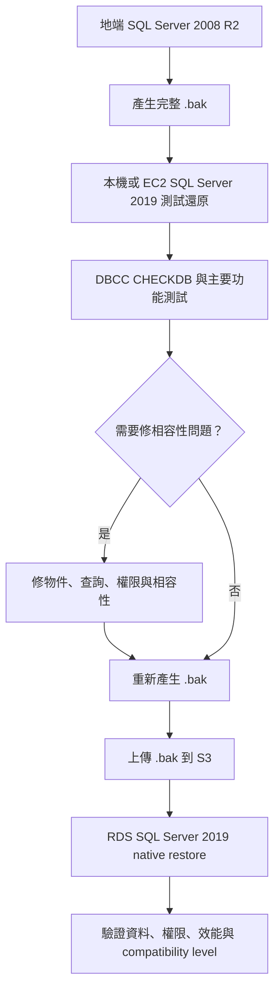

# MSSQL 2008 R2 遷移到 AWS RDS SQL Server 2019

地端 SQL Server 2008 R2 的資料庫要搬到 AWS RDS SQL Server 2019，優先路線是先用標準 `.bak` 做完整備份，上傳到 S3，再用 RDS for SQL Server 的 native restore stored procedure 還原；如果直接還原失敗，再用一台 SQL Server 2019 中繼環境先升級與檢查資料庫。

本文的名稱、路徑、S3 bucket、資料庫名稱與密碼都已改成公開文件用的占位符。

## 預計操作流程

現場操作可以先抓住三件事：地端先產生 `.bak`、把 `.bak` 上傳到 S3、再到 RDS SQL Server 執行 restore stored procedure。下面是最短版流程，細節與驗證項目再往後看。

1. 在地端 SQL Server 2008 R2 預備備份 SQL，針對每個要遷移的 user database 各產生一份 `.bak`。

    ```sql
    BACKUP DATABASE [DB_NAME]
    TO DISK = N'D:\backup\DB_NAME.bak'
    WITH
        COMPRESSION,
        CHECKSUM,
        INIT,
        STATS = 10;
    ```

2. 到 AWS Console 的 S3 bucket 畫面上傳 `.bak` 檔案，並記下檔案 ARN。

    ```text
    arn:aws:s3:::BUCKET_NAME/sql-backup/DB_NAME.bak
    ```

3. 連到 AWS RDS for SQL Server，在 RDS 端執行 restore stored procedure，從 S3 還原資料庫。

    ```sql
    EXEC msdb.dbo.rds_restore_database
        @restore_db_name = 'DB_NAME',
        @s3_arn_to_restore_from = 'arn:aws:s3:::BUCKET_NAME/sql-backup/DB_NAME.bak';
    ```

<note>
如果來源環境在跨境網路較受限的位置，且公司政策允許使用 Microsoft 365 OneDrive 作為暫存傳輸，可以先把 `.bak` 上傳到 OneDrive，再從本機下載後用 Docker SQL Server 2019 還原測試。正式資料庫備份通常包含敏感資料，傳輸前要先確認加密、權限控管與資料保護規範。
</note>

## 快速結論

- SQL Server 2008 R2 `.bak` 還原到 SQL Server 2019 通常是可行的；RDS 的限制在於不能直接掛 storage 或 attach MDF，而是必須透過 S3 與 RDS stored procedure。
- 正式搬遷前，建議先在本機或 EC2 的 SQL Server 2019 測一次 restore、`DBCC CHECKDB` 與主要功能流程。
- `Extract Data-tier Application` 主要是 `.dacpac` schema，不適合當完整資料庫搬遷主線；`Export Data-tier Application` 的 `.bacpac` 可搬 schema + data，但大型或老系統通常比 `.bak` 更容易卡。
- `COMPATIBILITY_LEVEL` 不要一開始就急著升到 `150`；先保留 `100` 驗證舊系統能跑，再用 Query Store 做基準與升級測試。

## 適用情境

這篇筆記對應的情境是：

- Source：SQL Server 2008 R2 SP3 / Standard Edition
- Target：AWS RDS for SQL Server 2019 / Standard Edition
- 來源端可以產生 `.bak`
- 目標端使用 RDS managed SQL Server，不能用傳統 Windows storage attach 或直接還原本機路徑
- 需要評估 `.bak`、DACPAC、BACPAC、DMS、BCP 這幾種做法的取捨

## 遷移方式比較

| 方式 | 適合情境 | 優點 | 注意事項 |
| --- | --- | --- | --- |
| Native backup / restore `.bak` | 可以停機或可接受維護窗口，資料庫可完整備份 | 最接近原本 SQL Server 搬遷方式，通常最快、保留 DB 內大多數物件 | RDS 必須走 S3 與 `rds_restore_database`；login、job、linked server 等 server-level 物件要另外處理 |
| `.bak` 先還原到 SQL Server 2019 中繼環境 | RDS 直接 restore 失敗，或想先做升級驗證 | 可以先跑 `DBCC CHECKDB`、修相容性、重建備份，再進 RDS | 需要本機 Docker、EC2 或 VM 作為暫存環境 |
| AWS DMS | 需要降低停機時間，或 source 還要持續寫入 | 可做 full load + CDC，最後切換停機較短 | 偏資料同步，不是完整 SQL Server instance 搬家；schema、index、FK、trigger、login、job 常要另處理 |
| Extract Data-tier Application `.dacpac` | 只要搬 schema 或比對 schema | 適合建立乾淨 target schema | 不是正式搬資料方案 |
| Export Data-tier Application `.bacpac` | 小到中型資料庫，schema 相對單純 | 包含 schema + table data，可跨版本邏輯匯入 | 大型 DB、舊系統或特殊物件容易慢或失敗 |
| Generate Scripts + BCP | `.bak` 不可用，但想掌握每個 table 的匯出匯入 | 可分批、平行化、可控 | FK、identity、trigger、index、順序與驗證都要自己處理 |

## 建議流程



## 來源端檢查

先確認來源資料庫狀態、相容性等級、recovery model 與是否有 RDS 不支援的功能。

```sql
SELECT @@VERSION;

SELECT name,
       compatibility_level,
       recovery_model_desc
FROM sys.databases
WHERE database_id > 4;

SELECT *
FROM sys.dm_db_persisted_sku_features;

SELECT name,
       type_desc,
       physical_name
FROM sys.database_files;
```

特別注意：

- `compatibility_level` 如果是 SQL Server 2008 R2，常見會是 `100`。
- 是否使用 `FILESTREAM`。RDS for SQL Server native restore 對某些 filegroup 與功能有限制。
- 是否有 linked server、SQL Agent job、login、credential、server trigger、SSIS package 等 server-level 物件。
- 是否有 cross-database dependency，搬到 RDS 後每個 DB 名稱與權限是否仍一致。

## 建立備份

在來源端建立完整備份。若來源版本或 edition 不支援 `COMPRESSION`，移除該選項後再備份。

```sql
BACKUP DATABASE [DB_NAME]
TO DISK = N'D:\backup\DB_NAME.bak'
WITH
    COMPRESSION,
    CHECKSUM,
    INIT,
    STATS = 10;
```

備份後先驗證備份檔。

```sql
RESTORE VERIFYONLY
FROM DISK = N'D:\backup\DB_NAME.bak'
WITH CHECKSUM;
```

## 在 SQL Server 2019 測試還原

正式丟 RDS 前，先在 SQL Server 2019 測還原最能提早抓出版本升級問題。中繼環境可以是本機 Docker、EC2 Windows + SQL Server，或任何可控的 SQL Server 2019 instance。

本機 Docker 測試範例：

```bash
docker pull --platform linux/amd64 mcr.microsoft.com/mssql/server:2019-latest

mkdir -p ./mssql-backup
export MSSQL_SA_PASSWORD='REPLACE_WITH_STRONG_PASSWORD'

docker run --platform linux/amd64 \
  -e ACCEPT_EULA=Y \
  -e MSSQL_SA_PASSWORD="$MSSQL_SA_PASSWORD" \
  -e MSSQL_PID=Developer \
  -e MSSQL_AGENT_ENABLED=true \
  -p 1434:1433 \
  --name mssql2019 \
  --hostname mssql2019 \
  -v mssql2019-data:/var/opt/mssql \
  -v "$PWD/mssql-backup:/var/opt/mssql/backup" \
  -d mcr.microsoft.com/mssql/server:2019-latest
```

<note>
SQL Server Linux container 官方主要支援 x86-64 主機。在 Apple Silicon 上用 `--platform linux/amd64` 可以作為遷移測試環境，但不要把它視為正式 production 支援架構。
</note>

把 `.bak` 放到 `./mssql-backup` 後，先看備份檔內的 logical file name。

```bash
docker exec mssql2019 /opt/mssql-tools18/bin/sqlcmd -C \
  -S localhost \
  -U sa \
  -P "$MSSQL_SA_PASSWORD" \
  -Q "RESTORE FILELISTONLY FROM DISK = N'/var/opt/mssql/backup/DB_NAME.bak';"
```

假設 logical file name 是 `DB_NAME_Data` 與 `DB_NAME_Log`，還原時要用 `WITH MOVE` 改成 Linux container 內的路徑。

```bash
docker exec mssql2019 /opt/mssql-tools18/bin/sqlcmd -C \
  -S localhost \
  -U sa \
  -P "$MSSQL_SA_PASSWORD" \
  -b \
  -Q "RESTORE DATABASE [DB_NAME]
      FROM DISK = N'/var/opt/mssql/backup/DB_NAME.bak'
      WITH
        MOVE N'DB_NAME_Data' TO N'/var/opt/mssql/data/DB_NAME.mdf',
        MOVE N'DB_NAME_Log' TO N'/var/opt/mssql/data/DB_NAME_log.ldf',
        STATS = 5;"
```

如果 source 是 SQL Server 2008 R2，還原到 SQL Server 2019 時會看到資料庫 internal version 被升級。這代表這份 DB 已經不能再 attach / restore 回 SQL Server 2008 R2，原始 `.bak` 要保留。

## 還原後驗證

測試還原成功後，先確認 DB 狀態與相容性等級。

```sql
SELECT name,
       state_desc,
       compatibility_level,
       recovery_model_desc
FROM sys.databases
WHERE name = N'DB_NAME';
```

跑一致性檢查。

```sql
DBCC CHECKDB(N'DB_NAME') WITH NO_INFOMSGS;
```

確認 user table 數量。

```sql
USE [DB_NAME];

SELECT COUNT(*) AS user_table_count
FROM sys.tables
WHERE is_ms_shipped = 0;
```

也可以先掃幾個常見舊語法或舊功能關鍵字。這不是完整相容性檢查，但能快速抓出部分風險。

<code-block lang="sql" ignore-vars="true"><![CDATA[
SELECT o.type_desc,
       SCHEMA_NAME(o.schema_id) AS schema_name,
       o.name
FROM sys.sql_modules AS m
JOIN sys.objects AS o
    ON o.object_id = m.object_id
WHERE m.definition LIKE '%*=%'
   OR m.definition LIKE '%=*%'
   OR m.definition LIKE '%FASTFIRSTROW%'
   OR m.definition LIKE '%sp_dboption%'
   OR m.definition LIKE '%READTEXT%'
   OR m.definition LIKE '%WRITETEXT%'
   OR m.definition LIKE '%UPDATETEXT%'
ORDER BY o.type_desc,
         schema_name,
         o.name;
]]></code-block>

## 上傳到 S3

RDS for SQL Server native restore 會從 S3 讀取 `.bak`。S3 bucket 建議和 RDS 在同一個 AWS Region。

```bash
aws s3 cp DB_NAME.bak s3://BUCKET_NAME/sql-backup/DB_NAME.bak
```

RDS restore 會使用 S3 ARN。

```text
arn:aws:s3:::BUCKET_NAME/sql-backup/DB_NAME.bak
```

## RDS 前置設定 {#rds-prerequisites}

RDS for SQL Server 要能從 S3 restore，通常需要：

- 建立或選擇 S3 bucket。
- 建立 IAM role，允許 RDS 存取指定 S3 object。
- 在 RDS option group 啟用 `SQLSERVER_BACKUP_RESTORE`。
- 將 option group 套用到 RDS instance。
- 使用 master user 或具備 `rds_superuser` 的帳號執行 restore。

確認目前登入權限：

```sql
SELECT IS_MEMBER('rds_superuser') AS is_rds_superuser;
```

## 還原到 AWS RDS SQL Server

RDS 端使用 `msdb.dbo.rds_restore_database` 還原。

```sql
EXEC msdb.dbo.rds_restore_database
    @restore_db_name = 'DB_NAME',
    @s3_arn_to_restore_from = 'arn:aws:s3:::BUCKET_NAME/sql-backup/DB_NAME.bak';
```

查詢 restore task 狀態。

```sql
EXEC msdb.dbo.rds_task_status
    @db_name = 'DB_NAME';
```

如果要取消 task：

```sql
EXEC msdb.dbo.rds_cancel_task
    @task_id = TASK_ID;
```

## RDS 還原後調整 {#rds-post-restore}

先跑基本狀態檢查。

```sql
SELECT name,
       state_desc,
       compatibility_level,
       recovery_model_desc
FROM sys.databases
WHERE name = N'DB_NAME';
```

更新統計資訊。

```sql
USE [DB_NAME];
EXEC sp_updatestats;
```

重建 login / user 對應。SQL Server 2008 R2 常見 `sp_change_users_login`，但新環境建議改用 `ALTER USER ... WITH LOGIN`。

```sql
USE [DB_NAME];

ALTER USER [APP_USER]
WITH LOGIN = [APP_LOGIN];
```

如果要建立新的 login 與 database user：

```sql
USE [master];

CREATE LOGIN [APP_LOGIN]
WITH PASSWORD = 'REPLACE_WITH_STRONG_PASSWORD';

USE [DB_NAME];

CREATE USER [APP_USER]
FOR LOGIN [APP_LOGIN];

ALTER ROLE db_datareader ADD MEMBER [APP_USER];
ALTER ROLE db_datawriter ADD MEMBER [APP_USER];
```

## Compatibility level 升級策略

SQL Server 2008 R2 restore 到 SQL Server 2019 後，`compatibility_level` 通常仍會保留在 `100`。這是預期行為，也是一條比較安全的遷移路線。

不要在 restore 完立刻把正式 DB 升到 `150`。建議流程是：

1. 保留 `100`，先跑應用程式主要流程。
2. 開啟 Query Store，建立效能 baseline。
3. 在測試環境升到 `150`。
4. 跑同一套功能與效能測試。
5. 確認沒有 regression 後，再規劃正式環境升級。

開啟 Query Store：

```sql
ALTER DATABASE [DB_NAME]
SET QUERY_STORE = ON;

ALTER DATABASE [DB_NAME]
SET QUERY_STORE (
    OPERATION_MODE = READ_WRITE,
    QUERY_CAPTURE_MODE = AUTO
);
```

升級 compatibility level：

```sql
ALTER DATABASE [DB_NAME]
SET COMPATIBILITY_LEVEL = 150;
```

如果升級後出現查詢計畫 regression，可先退回：

```sql
ALTER DATABASE [DB_NAME]
SET COMPATIBILITY_LEVEL = 100;
```

也可以針對 SQL Server 2019 的部分 optimizer feature 做 database-scoped 調整。

```sql
ALTER DATABASE SCOPED CONFIGURATION
SET LEGACY_CARDINALITY_ESTIMATION = ON;

ALTER DATABASE SCOPED CONFIGURATION
SET TSQL_SCALAR_UDF_INLINING = OFF;

ALTER DATABASE SCOPED CONFIGURATION
SET DEFERRED_COMPILATION_TV = OFF;

ALTER DATABASE SCOPED CONFIGURATION
SET BATCH_MODE_ON_ROWSTORE = OFF;
```

這些設定不是一開始就要全部關掉，而是用來排查升級後的效能差異。

## 常見問題

### `.bak` 不能直接從 storage 還原到 RDS

RDS 是 managed service，不能像地端 SQL Server 一樣直接掛 Windows storage 或 attach MDF。正確方式是 `.bak` 上傳 S3，再從 RDS 執行 restore stored procedure。

### RDS restore 權限不足

檢查：

- 執行帳號是否為 master user 或 `rds_superuser`。
- RDS option group 是否已啟用 `SQLSERVER_BACKUP_RESTORE`。
- IAM role 是否允許讀取對應 S3 object。
- S3 bucket 是否和 RDS 位於相同 Region。

### RDS 已有同名 database

RDS restore 前要確認目標 DB 名稱不存在，或先用另一個名稱還原測試。若要刪除既有測試 DB，先切 single user。

```sql
ALTER DATABASE [DB_NAME]
SET SINGLE_USER
WITH ROLLBACK IMMEDIATE;

DROP DATABASE [DB_NAME];
```

### 還原到 SQL Server 2019 後能不能回 SQL Server 2008 R2

不能。資料庫一旦被 SQL Server 2019 升級 internal version，就不能再還原或 attach 回 SQL Server 2008 R2。要回復只能用原始 SQL Server 2008 R2 的備份。

### 什麼時候改用 DMS

如果資料庫很大、停機時間不能接受，或需要先 full load 再持續同步變更，可以評估 AWS DMS。只是 DMS 不會完整搬走所有 SQL Server instance 層級物件，正式切換前仍要另外處理 login、job、constraint、index、trigger 與資料一致性驗證。

## 遷移檢查清單

- Source SQL Server 2008 R2 已確認 SP 與版本資訊。
- 已確認 DB `compatibility_level`、recovery model、filegroup 與特殊功能。
- 已建立 full backup 並通過 `RESTORE VERIFYONLY`。
- 已在 SQL Server 2019 中繼環境成功 restore。
- 已跑 `DBCC CHECKDB`。
- 已盤點 login、SQL Agent job、linked server、credential 與權限。
- 已確認 RDS option group、IAM role 與 S3 ARN。
- 已在 RDS restore 並用 `rds_task_status` 確認完成。
- 已更新統計資訊與修正 login/user mapping。
- 已用 `100` compatibility level 跑主要功能測試。
- 已用 Query Store 規劃 `150` compatibility level 升級驗證。

## 參考資料

- [Amazon RDS for SQL Server native backup and restore](https://docs.aws.amazon.com/AmazonRDS/latest/UserGuide/SQLServer.Procedural.Importing.html)
- [Amazon RDS for SQL Server supported versions](https://docs.aws.amazon.com/AmazonRDS/latest/UserGuide/SQLServer.Concepts.General.VersionSupport.html)
- [SQL Server compatibility level](https://learn.microsoft.com/en-us/sql/t-sql/statements/alter-database-transact-sql-compatibility-level)
- [Query Store upgrade workflow](https://learn.microsoft.com/en-us/sql/relational-databases/performance/query-store-usage-scenarios)
- [SQL Server Docker quickstart](https://learn.microsoft.com/zh-tw/sql/linux/quickstart-install-connect-docker)
