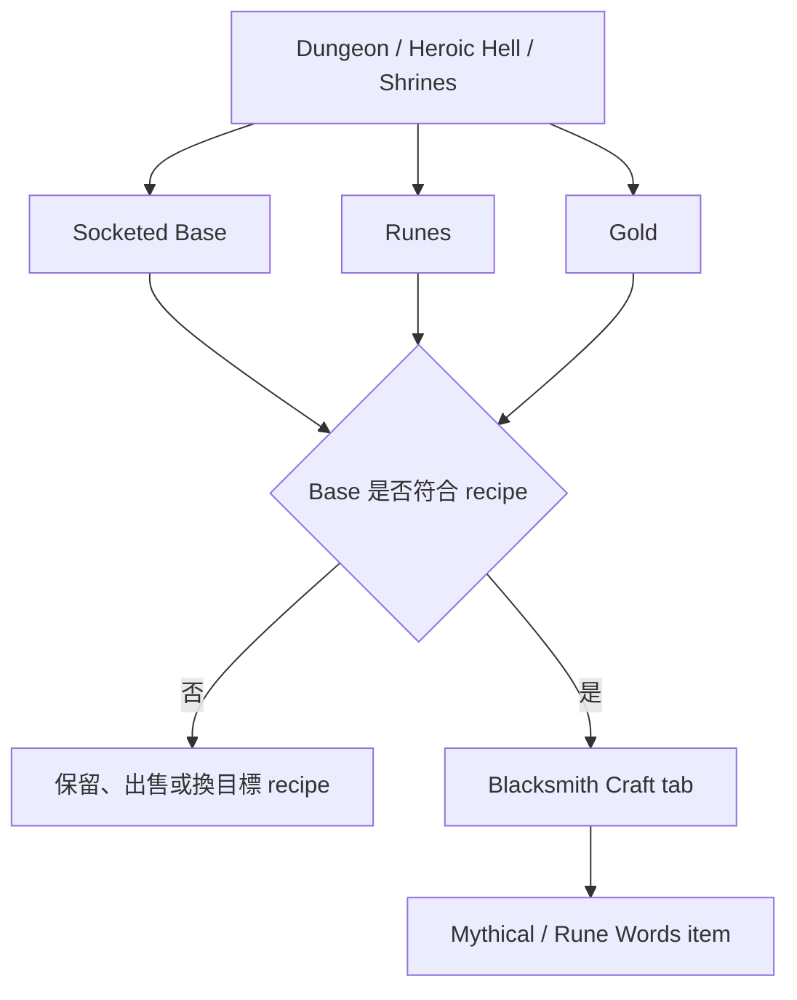

# Nevergrind Online Blacksmith Crafting / Recipe 深度筆記

Nevergrind Online 的 Blacksmith crafting 不是單一版本一次完成的功能，而是從 Season 2 的 runes、socketed items、ethereal / indestructible 裝備開始鋪路，再逐步啟用 enchanting counter、Craft tab、Mythical items / Rune Words、rune upgrade 與 Season 3 全配方。實務上，玩家應該先理解「已公開的規則」與「尚未公開的精確配方」之間的界線，再決定哪些 socketed base 值得留下來做 Mythical 裝備。

- 檢視日期：`2026-05-03`
- 前置閱讀：[Blacksmith 鍛造鋪指南](nevergrind-online-blacksmith.md)、[符文 Runes 指南](nevergrind-online-runes.md)
- 資料來源：使用者提供的研究報告摘要、SteamDB patch notes、[Nevergrind Online 攻略DB：クラフト](https://atelier3.web.fc2.com/ngo/mythical.html)
- 版本提醒：crafting recipes、rune upgrade、socket 上限、UI 成本顯示與可 craft 底材，仍可能隨版本更新；投入稀有 rune 前請再看當前遊戲內 UI

<tldr>

官方公開資料能確認 crafting 系統、底材規則、已完成的 Mythical item 家族與部分 bug 修正，但沒有公開完整逐件 recipe list。

Crafting 最重要的素材不是只有 rune，而是灰色 / socketed base；帶有 special properties、Superior、Ethereal 或正確職業詞綴的 base 會大幅影響成品價值。

目前更安全的判讀方式是：規則看官方 patch notes，成品方向看資料庫，實際 recipe、金幣成本與可 craft 狀態以遊戲內 Craft tab 為準。

</tldr>

## 證據可靠性怎麼看

這類資料最容易混在一起：官方 patch notes、SteamDB 鏡射、日文攻略DB、社群資料庫、玩家討論串與舊版 Nevergrind wiki。建議用下面的順序採信：

| 來源類型 | 適合確認 | 不適合直接推論 |
| ------ | ------ | ------ |
| 官方公告 / SteamDB patch notes | 系統何時啟用、哪些 item family 完成、哪些 bug 被修 | 每件成品的完整 rune formula |
| 遊戲內 Craft tab / tooltip | 當前版本 recipe、gold cost、base 是否可用 | 跨版本歷史規則 |
| 攻略DB / 社群資料庫 | 成品名稱、roll 範圍、常見配裝方向 | 官方未公開的機率與成本 |
| 玩家討論串 | 常見卡住點、特定版本 bug | 已修正後的永久規則 |

<warning>

原版 Nevergrind 的 item upgrade 資料不能直接套用到 Nevergrind Online。兩者名稱接近，但系統與版本脈絡不同。

</warning>

## 已確認的系統架構

目前公開資料最清楚的分界，是 `Enchanting Counter` 與 `Craft tab / Crafting Counter`：

| 功能 | 做什麼 | 重點 |
| ------ | ------ | ------ |
| `Enchanting Counter` | 把 rune bonus 加到 socketed item 上 | 這是一般 rune socketing / enchanting，重點是 rune 對應部位與裝備是否值得長期穿 |
| `Craft tab` / `Crafting Counter` | 用 socketed base + recipe runes 製作 Mythical / Rune Words 類裝備 | runes 不需要先鑲進裝備；base 的 sockets 數、底材等級與原生詞綴才是核心 |
| Rune upgrade via crafting | 在 crafting counter 進行 rune upgrade | patch notes 顯示此功能曾分批測試與修成本顯示，實際成本看當前 UI |

最保守的實務結論是：crafting 更像「條件符合才可執行」的交易，不是有公開失敗率的 RNG 鍛造。公開資料有提到 gold、runes、正確 base 與正確 socket count，但沒有找到官方公開的成功率、失敗率、製作時間、炸裝機率或黑鐵匠熟練度需求。

## Base item 為什麼變重要

Crafting 系統讓灰色 / socketed base 的價值被重新定義。SteamDB patch notes 顯示，socketed items 後來能帶 special properties，normal / socketed items 也能出現在 vendors；攻略DB Craft 頁則補充，craft 後 base 上既有 talents、skill enhancements、Superior、Ethereal 與材質 / 基礎性能都會影響成品。

挑 base 時先看這些：

| 判斷 | 為什麼重要 |
| ------ | ------ |
| Sockets 數 | 必須剛好等於 recipe 要求的 rune 數，多一孔或少一孔都不適合 |
| Special properties | 官方 patch notes 指出 socketed base 的 special properties 在成功 craft Mythical item 後會保留 |
| `Superior` | 可保留武器傷害或防具物理防禦加成，但也曾有計算 bug 被修正 |
| `Ethereal` | 狀態會繼承，但 craft 不會恢復耐久度；是否值得投資要看風險 |
| 職業 talents / skill enhancements | 若 base 已有特定職業方向，成品隨機 mod 可能被鎖定到該職業 |
| Base level | 成品 required level 會取 recipe level 與 base item level 較高者 |

## 官方明確提到的 Mythical families

官方沒有公開完整逐件 recipe list，但 patch notes 已經明確點名 Season 3 前後完成的一批 Mythical item families。

| 類型 | 官方公開狀態 | 筆記判讀 |
| ------ | ------ | ------ |
| Helmets | 2025-05-03 patch notes 提到完成 | 可視為 Season 3 Mythical crafting 家族之一 |
| Chest armor | 2025-05-03 patch notes 提到完成 | 胸甲底材要特別注意 Superior / armor 計算與 required level |
| Shields | 2025-05-04 patch notes 提到完成 | shield socket 上限與 rune / armor 顯示曾被調整，實作看當前 UI |
| Focus items | 2025-05-09 patch notes 提到完成 | 有一件 focus item 曾先在 Season 2 測試 |
| Bows | 2025-05-11 patch notes 提到完成 | 有一件 bow item 曾先解鎖測試 |
| Staves | 2025-05-17 patch notes 提到完成 | caster / healer 需要同時看 base、cast / resource 與職業詞綴 |
| 1HB、1HS、2HB、2HS、piercing weapons | 2025-05-17 patch notes 提到完成 | 這批構成近戰武器 Mythical crafting 的主要骨架 |
| All recipes | 2025-05-29 patch notes 提到 Season 3 crafting counter 開放全部 recipes | 舊版「preview / testing」資訊只當歷史脈絡，配方以當前 UI 為準 |

沒有在官方公告中逐件公開的內容，例如某件成品確切需要哪幾顆 rune、各幾顆、需要多少 gold、是否有隱藏權重，筆記中應維持「未公開」或「以 UI 為準」，不要把社群傳聞寫成固定規則。

## 素材與 farming 方向

想做 Mythical / Rune Words，素材管線比單件裝備更重要。

1. 先保留灰色 / socketed base，尤其是帶 special properties、Superior 或職業詞綴的底材。
2. 用 Blacksmith、Apothecary、Merchant 巡店補 normal / socketed base。
3. 若目標是稀有 rune，優先關注 party size rare rune bonus、Heroic Hell rune drop rate，以及 rune shrine。
4. 若目標是好 base，armor / weapon shrines 值得納入路線，因為 patch notes 明說它們有高機率掉 socketed items，並服務 crafting 目的。
5. 做裝前先到 Craft tab 確認 recipe、gold、runes、base type、socket count 與 required level。

簡化流程可以記成：

## 常見誤判

| 誤判 | 比較安全的判斷 |
| ------ | ------ |
| 有 sockets 就是好 craft base | sockets 只是門票；special properties、職業詞綴、Superior、Ethereal 與 base level 才決定上限 |
| Craft 一定會吃到 rune 的一般鑲嵌效果 | Craft 消耗 rune 觸發 recipe，不等於先拿一般 rune bonus 再拿 recipe bonus |
| 找到一張舊配方表就能照抄 | Season 3 前後功能分階段開放，舊 preview 資訊只當歷史參考 |
| 成品等級看 recipe 就好 | 成品 required level 至少會考慮 base item level |
| 已 enchant 裝備也能拿來做 Mythical | patch notes 曾把 previously enchanted items 可被 craft 視為 bug |
| 成功率或失敗率可以假設存在 | 沒有官方公開百分比前，先把它當成條件式 crafting，而不是公開失敗率系統 |

## 版本與 bug 風險

Crafting 相關 patch notes 顯示，系統上線後修過不少 UI、成本、tooltip 與計算問題。這些不是要嚇人，而是提醒：看到舊截圖或舊討論串時，要先看日期。

| 日期 | 變動 / 修正 | 實務影響 |
| ------ | ------ | ------ |
| 2024-09-24 | runes、socketed items、ethereal、indestructible 進入遊戲 | Season 2 前置基礎形成 |
| 2024-10-24 | Blacksmith enchanting counter 啟用 | 一般 rune socketing 正式可用 |
| 2024-10-27 | rare rune party bonus 加入 | 組隊刷 rune 的價值提高 |
| 2024-11-23 | Heroic Hell rune drop rate 提高 | 高難度路線更適合累積 rune |
| 2025-04-13 | socketed items 可帶 special properties | craft base 的保留價值上升 |
| 2025-04-22 | 修正 previously enchanted items 可被 craft 的問題 | 已 enchant 裝備不要當正常 craft base |
| 2025-05-04 | 修正 crafting slot tooltip、Superior armor 與固定 armor bonus 計算 | 評估防具 base 時要信任新版 UI，不要用舊版數字 |
| 2025-05-17 | 修正 crafting window 替換物品造成 inventory disabled 的問題 | 舊版 UI 卡住問題可能已不適用 |
| 2025-05-20 | rune upgrade via crafting 與 crafting UI item icons 加入 | Craft tab 開始同時承擔 recipe 分類與 rune upgrade |
| 2025-05-29 | Season 3 full crafting system unlocked | 以 Season 3 後 UI 當主準 |
| 2025-06-28 | armor / weapon / rune shrines 加入 | shrines 成為 crafting 素材來源之一 |
| 2025-10-07 | 修正 craft rune 後成本顯示錯誤 | rune upgrade / crafting cost 看當前 UI |

## 實務結論

Blacksmith crafting 的重點不是背一張不存在於官方公告中的完整配方表，而是建立一套穩定判斷：

1. 規則看官方 patch notes 與當前遊戲內 UI。
2. 目標成品可以參考攻略DB / 社群資料庫，但不要把未公開 recipe 寫成定論。
3. 灰色 / socketed base 只要帶有 special properties、Superior、Ethereal 或職業詞綴，就值得暫存比較。
4. 高階 rune 不要投入測試用 base；先用便宜素材確認 UI 邏輯。
5. 多人、Heroic Hell、rune shrine、armor / weapon shrine 都應納入 crafting 素材農法。

## 參考資料

- [Nevergrind Online 攻略DB：クラフト](https://atelier3.web.fc2.com/ngo/mythical.html)
- [SteamDB: Season 2 Preview Patch](https://steamdb.info/patchnotes/15803867/)
- [SteamDB: Season 2 Begins! Enchanting With Runes Enabled](https://steamdb.info/patchnotes/16172899/)
- [SteamDB: Rune party bonus](https://steamdb.info/patchnotes/16195469/)
- [SteamDB: Improved rune drop rate in heroic hell](https://steamdb.info/patchnotes/16513214/)
- [SteamDB: Socketed items can now roll special properties](https://steamdb.info/patchnotes/18087916/)
- [SteamDB: Added Superior items and future crafting functionality](https://steamdb.info/patchnotes/18094203/)
- [SteamDB: Enabled the Crafting Counter](https://steamdb.info/patchnotes/18121869/)
- [SteamDB: Improved availability of socketed items](https://steamdb.info/patchnotes/18186975/)
- [SteamDB: Fixed crafting previously enchanted items](https://steamdb.info/patchnotes/18199384/)
- [SteamDB: Added new craftable mythical items](https://steamdb.info/patchnotes/18332694/)
- [SteamDB: Completed season 3 mythical shields](https://steamdb.info/patchnotes/18335716/)
- [SteamDB: Completed season 3 mythical focus items](https://steamdb.info/patchnotes/18397740/)
- [SteamDB: Completed season 3 mythical bows](https://steamdb.info/patchnotes/18421827/)
- [SteamDB: Completed initial season 3 crafting items](https://steamdb.info/patchnotes/18504437/)
- [SteamDB: Added ability to upgrade runes via crafting](https://steamdb.info/patchnotes/18527675/)
- [SteamDB: Season 3 full crafting system unlocked](https://steamdb.info/patchnotes/18665521/)
- [SteamDB: 3 New Room Types](https://steamdb.info/patchnotes/19038726/)
- [SteamDB: Crafting and Academy Bug Fixes](https://steamdb.info/patchnotes/20293638/)
