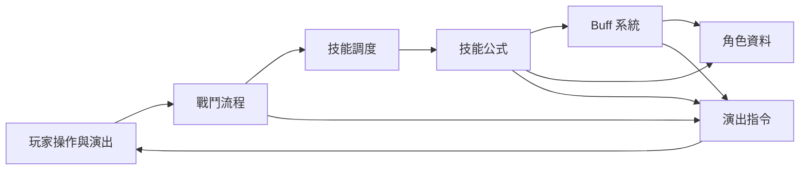
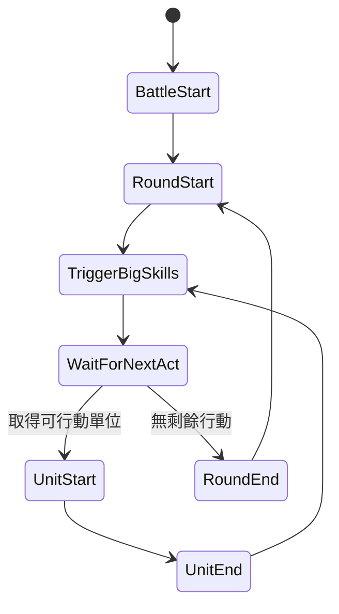

# Unity 回合制戰鬥核心設計：狀態機、技能、Buff 與單例

<web-summary>Unity 手遊同時只有一場玩家戰鬥時，單例可以合理代表目前戰鬥；透過狀態機安排時序、技能公式重用運算、Buff 集合保存效果，並以獨立情境測試保護已運作的規則。</web-summary>

先依遊戲的執行情境決定架構。客戶端同時只有一場玩家戰鬥時，可以保留代表目前戰鬥的 Singleton；把流程、技能運算、Buff 效果與演出資料分開，通常比為了套用更多設計模式而重構更有價值。

這個案例原本用於 Unity 手機遊戲。依作者的實際運行經驗，遊戲已運行兩年以上，未有明顯問題。這個背景支持原本需求下的設計選擇；後來補上的自動測試，則用來保護維護與擴充時的行為。

## 先把四種職責分開 {#battle-responsibilities}

核心分工可以整理成：**狀態機決定何時執行，技能公式決定如何執行，Buff 影響條件與數值，指令清單描述結果。**

| 職責 | 保存或處理的內容 | 主要邊界 |
| ------ | ------ | ------ |
| 戰鬥流程 | 回合、目前階段、行動排序與勝敗 | 決定下一個階段 |
| 技能資料 | 倍率、機率、冷卻、目標與公式名稱 | 描述一次技能的設定 |
| 技能公式 | 選人、命中、爆擊、傷害與治療 | 執行技能行為 |
| Buff 系統 | 生效、更新、到期、解除與共存效果 | 管理持續效果 |
| 角色資料 | 基礎屬性、調整值、HP 與行動旗標 | 保存戰鬥中的數值 |
| 演出指令 | 攻擊、受擊、死亡、選人與結束 | 交由外部介面呈現 |

以下是職責關係的示意，不是完整呼叫順序：



這樣核心可以計算戰鬥而不用直接操作 Unity 畫面。Console 範例與遊戲客戶端，也能各自消費同一種結果資料。

## 程式結構與設計模式對照 {#battle-pattern-map}

| 程式結構 | 對應概念 | 判讀 |
| ------ | ------ | ------ |
| `BattleStateEnum` 與 `GoToNextState()` | 有限狀態機 | 已有階段與轉移，不需要先拆 State 類別 |
| `ISkillFormula` 與各技能公式 | Strategy Pattern | 依技能選擇不同運算行為 |
| 攻擊、治療基底與 Buff 更新骨架 | Template Method | 固定主要步驟，讓子類別提供差異 |
| `CurrentBuffs` 與角色效果集合 | 多效果組合與生命週期 | 效果可以共存，不是單一互斥狀態 |
| 依公式名稱反射建立物件 | 工廠式建立機制 | 不因此等同 GoF Factory Method |
| `BattleSystem.Instance` | Singleton | 代表目前玩家戰鬥，依實際執行範圍評估 |
| 輸出的演出字串指令 | 資料契約 | 不因此等同 GoF Command Pattern |

狀態機是流程模型，State Pattern 是組織各狀態行為的方式。**狀態數量不是選 State Pattern 的主要依據；行為差異與轉移規則的複雜度才是。** 同一套規則如何用 switch、轉移表與狀態物件實作，見 [C# 狀態機、狀態模式與策略模式：差異與選擇](csharp-state-machine-state-pattern.md)。

## 已有狀態機，不必立即改成 State Pattern {#battle-state-machine}

只要有明確階段、轉移條件與階段動作，保存目前 enum 再用 `switch` 分派，就可以形成有限狀態機。各階段不必先拆成獨立物件。

這個核心的主要階段包括戰鬥開始、回合開始、大絕檢查、等待行動、單位開始、單位結束與回合結束。下面省略勝敗與回合上限的結束分支：



手動模式還要處理等待輸入。這個實作在發出選人指令前，會先把下一個階段設回大絕檢查；外部提交選人後，再次推進先檢查大絕，才繼續行動。

State Pattern 會把各階段行為移到 `RoundStartState` 等物件，改變的是組織方式。當階段變大、需要獨立依賴或測試入口時才評估這個拆分；已精簡的分派本身，不是必須重構的理由。

## 技能資料、策略與共用運算骨架 {#battle-skill-formulas}

技能資料保存倍率、觸發機率、目標數與附加效果；公式實作決定計算方式。同一種「攻擊後附加 Buff」公式，可以搭配多組資料形成不同技能。

不同公式符合策略式設計，而攻擊或治療基底提供的固定步驟，則適合用 Template Method 理解。例如攻擊流程共用選人、命中、傷害、死亡處理與指令輸出，子類別只覆寫命中後效果或特殊傷害。

擴充時先問：差異是資料還是演算法？

- 倍率、機率與目標數不同，先調整資料。
- 命中後要多做一個效果，沿用攻擊基底的擴充點。
- 目標規則或傷害方式不同，再增加相應公式。

本案例以 `FormulaName` 配合固定命名空間反射建立公式。這是建立機制，不必硬套成完整的 Factory Method Pattern。新增公式時，要一起確認名稱、介面與建構子；技能公式接收技能定義，Buff 公式則接收定義、目標與來源。

公式能成功建立，只證明名稱與建構子契約成立。它是否選對目標、造成正確傷害，仍需要行為測試。

## Buff 保存共存效果，持續時間依更新次數計算 {#battle-buff-lifecycle}

戰鬥階段通常互斥，角色效果則可以共存：中毒、睡眠與防禦增益可能同時存在。把它們放在效果集合中，可以各自管理生效與解除，不必為每種組合建立新狀態。

這個核心的 Buff 更新順序是：

1. 確認目標存活。
2. 執行效果的 `Update()`。
3. 被動或無限持續效果保留；有限效果扣除一次 `Duration`。
4. 到期時執行 `End()` 與 `Final()`。

因此，`Duration = 2` 表示在指定時機更新兩次，不能直接解讀成兩個全場回合。回合開始、單位開始、單位結束與受擊後，是不同的結算時機。

數值型 Buff 可修改固定調整值或百分比調整值，解除時還原。維護同 ID 替換、驅散與死亡流程時，要一起核對效果清單與數值變化。這是驗證效果生命週期的方法，不是推定既有遊戲已有殘留問題。

## 同時只有一場戰鬥時，Singleton 是合理選擇 {#battle-singleton-context}

`BattleSystem.Instance` 在原本需求中表示「玩家目前這場戰鬥」。技能、Buff 與指令系統由這個入口取得服務，可以簡化客戶端的使用方式。實際運行經驗也應納入評估，而不是只看到全域入口就判定架構有問題。

開始下一場時，`Init()` 會更新戰鬥資料、重設回合數，並重新建立技能、Buff 與指令系統。入口物件的生命週期可以比單場戰鬥長，而每場的子系統重新建立。

| 需求 | 評估方向 |
| ------ | ------ |
| 客戶端同時一場玩家戰鬥 | 保留目前戰鬥的單例入口 |
| 同一程序依序驗證多個情境 | 每個情境初始化，資料與亂數狀態隔離 |
| 同時進行多場背景模擬 | 評估每場獨立 Context 與子系統 |
| 已有可重現的初始化或資料生命週期問題 | 針對證據修正受影響的範圍 |

資料重用、動畫回呼或 Coroutine 的生命週期，可以在相關變更時驗證；沒有重現證據時，應把它們視為檢查方向。也不必為了可能存在的未來需求，立即將所有公式改成依賴注入。

單例的語法示例可參考 [C# 單例模式](C#-單例模式.md)。這份筆記關心的是使用範圍與維護取捨。

## 演出輸出是資料契約，不等於 Command Pattern {#battle-command-contract}

這個核心輸出字串指令，讓客戶端知道要播放攻擊、受擊、狀態變化與死亡。指令的名稱不代表它一定是封裝 `Execute()`、撤銷等行為的 GoF Command 物件。

尤其要分清楚兩個操作：

| 操作 | 本案例的行為 |
| ------ | ------ |
| `GoToNextState()` | 一次呼叫可能連續推進多個階段 |
| `GetCommand()` | 取出並清空指令，沒有指令時也可能推進戰鬥 |

`GetCommand()` 不是純讀取操作。手動等待時可能回傳選人指令；戰鬥完成且指令取完後才回傳 `null`。

攻擊指令包含後續內容數量，部分狀態指令先暫存再合併。維護格式或輸出順序時，要同時確認計算端與消費端，不能只檢查某一行字串。

## 用獨立情境測試保護既有規則 {#battle-regression-tests}

目前 repo 已將 Console 範例與自動測試分開。核心保留 `.NET Standard 2.0` 相容性目標，Sample 與 Tests 在 `.NET 10` 上執行；這個分工讓維護工具更新時，可以保留既有客戶端使用的 API 邊界。

自動測試使用獨立的最小資料，每個情境建立新的角色、技能、Buff 與選項，再初始化戰鬥。配合單例設計，測試組件關閉平行執行；情境工廠設定固定亂數 seed，結束時恢復原亂數。

固定 seed 只能穩定相同的亂數呼叫順序。需要精確傷害值時，也要控制命中、爆擊、觸發機率與傷害倍率。

優先保護的契約包括：

- 勝利、失敗、回合上限、手動等待與連續初始化。
- Buff 指定時機倒數、到期還原、同 ID 替換、驅散與死亡清理。
- 沉默與封印造成的技能重選，以及代表性反擊／追擊鏈的終止。
- 指令取出後清空、攻擊內容數量與死亡／狀態指令的順序。
- 公式名稱、命名空間與建構子參數。

在來源 repo 根目錄可執行：

```bash
dotnet build Battle.sln -c Release
dotnet test Battle.sln -c Release
dotnet run --project samples/Battle.Sample/Battle.Sample.csproj -- --non-interactive
```

確認測試有實際執行的案例數，並確認非互動範例輸出結束指令。公式建立測試不是全部公式的行為驗證，Console 輸出也不等於自動斷言；這些檢查各自保護不同的邊界。

遊戲兩年以上的運行經驗、目前的自動測試與實際 Unity 執行環境，是不同層次的證據。這份筆記依文件、程式碼及既有測試整理，沒有因此宣稱已重新驗證所有技能組合或 Unity 裝置行為。

## 資料來源 {#battle-sources}

- [來源 repo 的專案說明](https://github.com/jakeuj/Battle/blob/0094f24902c23455410fbdab6c5f1ee6b1f1cf13/readme.md)
- [來源 repo 的架構說明](https://github.com/jakeuj/Battle/blob/0094f24902c23455410fbdab6c5f1ee6b1f1cf13/Doc/architecture.md)
- [來源 repo 的測試與驗證](https://github.com/jakeuj/Battle/blob/0094f24902c23455410fbdab6c5f1ee6b1f1cf13/Doc/testing.md)
- [C# 單例模式](C#-單例模式.md)
