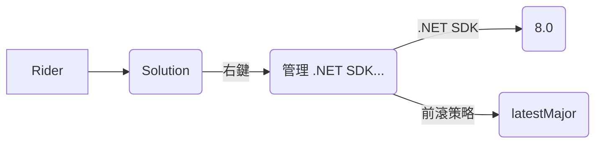

# 指定 dotnet SDK 版本

最近裝了 .NET 9.0，但專案是 .NET 8，所以想要指定 .NET SDK 版本

## global.json
Rider 設定方式

## REF
[使用 global.json 精準的選擇 .NET SDK 版本](https://blog.miniasp.com/post/2021/06/04/Choose-the-right-DotNet-SDK-version-using-global-json)